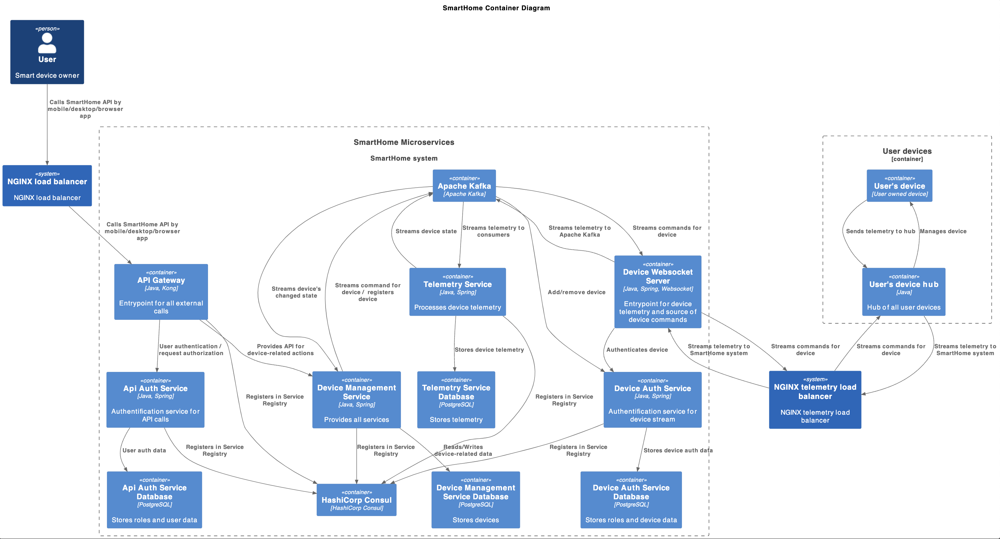
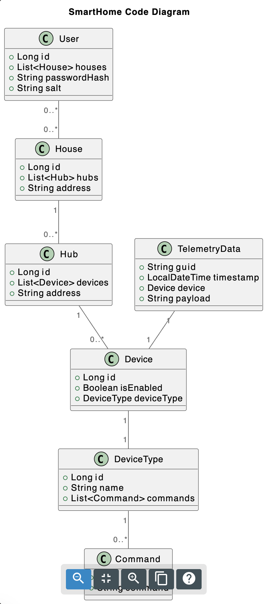

# Часть 1:
  ## Задание 1. Анализ и планирование:
  1. Изучите функциональность монолитного приложения:
      - Управление отоплением. Пользователи могут удалённо включать/выключать отопление в своих домах.
      - Мониторинг температуры. Система получает данные о температуре с датчиков, установленных в домах. Пользователи могут просматривать текущую температуру в своих домах через веб-интерфейс.

  2. Проанализируйте архитектуру монолитного приложения:
      - Язык программирования: 
        Java
      - База данных: 
        PostgreSQL
      - Архитектура: 
        Монолитная, все компоненты системы (обработка запросов, бизнес-логика, работа с данными) находятся в рамках одного приложения.
      - Взаимодействие: 
        Синхронное, запросы обрабатываются последовательно.
      - Масштабируемость: 
        Ограничена, так как монолит сложно масштабировать по частям.
      - Развёртывание: 
        Требует остановки всего приложения.

  3. Определите домены и границы контекстов.
      - Управление устройствами
        - Включение/выключение устройства
        - Изменения температуры на устройстве
      - Мониторинг устройства
        - Отображение установленной температуры на устройстве
        - Обновление состояния устройства
      - Сенсоры (пока не реализовано)
        - Изменение состояния сенсора с отслеживанием времени последнего изменения
      - Пользователи
        - Подключение устройств
        - Удаление устройств
        - Аутентификация/авторизация

  4. Проведите анализ архитектуры монолитного приложения.
      Приложение взаимодействует со всеми пользователями в синхронном режиме.  
      Проблемы:
        - Отсутствует авторизация/аутентификация
        - Изменение данных в БД происходят вне транзакций, существует опасность неконсистентности изменений.
        - Система заточена под работу с конкретным типом устройства.
        - Система имеет предел пользователей, упираясь в:
          * количество потоков, выделенных под пользовательские запросы
          * количество процессов, которые готова выделить база данных для запросов/команд приложения
      
      Система готова к увеличению количества пользователей при условии: 
        - Используются те же устройства, что и прежде
        - Вшитый в устройства URL, на который они обращаются, подменяется балансировщиком (например, nginx), который будет балансировать нагрузку   между несколькими инстансами приложения (приложение готово к работе в распределенном режиме)
        - Приложение обращается не напрямую в БД, а на балансировщик, установленный перед ней, а сам кластер базы данных дополняется репликами на чтение.  

  5. Визуализируйте контекст системы.
  [файл puml](https://github.com/popovanton/swa-practicum-sprint-3/blob/sprint_3/puml/Context_monolith_part1_task1.puml)

  

  ## Задание 2. Проектирование микросервисной архитектуры:
  [файл puml](/puml/Container_microservice_part1_task2.puml)
  
  

  ## Задание 3. Разработка ER-диаграммы
  [файл puml](/puml/Code_microservice_part1_task3.puml)
  
  
